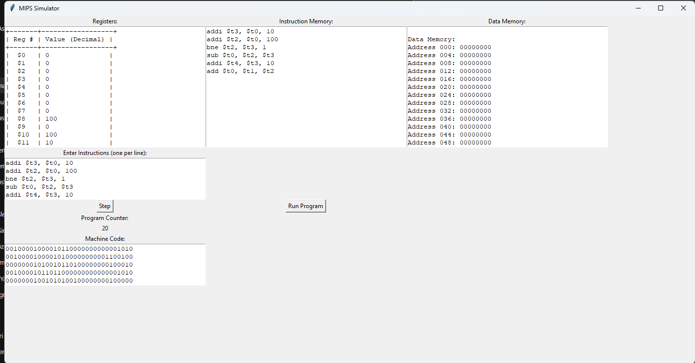

# MIPS Simulator with GUI


This project is a MIPS simulator developed to simulate MIPS Assembly instructions. Users can input a series of MIPS instructions and execute them step by step. The project is a desktop application built using the `tkinter` library, offering a user-friendly graphical interface.

## Features

- **Register Status Display:** Displays the 32 MIPS registers and the program counter (PC) on the screen.
- **Instruction Memory Display:** Displays the instructions entered by the user in memory.
- **Data Memory Display:** Shows the content of the data memory.
- **Step-by-Step Execution:** The user can execute instructions step by step, and the simulator updates its state with each step.
- **Run Entire Program:** Users can execute the entire program in one go.
- **Machine Code Display:** Displays the machine code for each MIPS instruction entered.

## Requirements

- Python 
- Tkinter library (included with Python)
- Additional libraries: `messagebox` (a part of Tkinter, no installation required)

## Supported Instructions

This simulator supports the following MIPS instructions:

### R-Type Instructions:
- `add`
- `sub`
- `and`
- `or`
- `slt`
- `sll`
- `srl`


### I-Type Instructions:
- `addi`
- `lw`
- `sw`

### J-Type Instructions:
- `j`
- `jal`
- `jr`

## Installation

### 1. Install Python
Ensure that Python is installed on your system. You can download Python from [here](https://www.python.org/downloads/).

### 2. Required Libraries
The project only uses Python's standard libraries, so no additional libraries need to be installed.

### 3. Running the Application
Follow these steps to run the simulator:

1. Download or clone the project to your computer.
2. Open a terminal or command prompt and navigate to the project directory.
3. Run the program with the following command:
   ```bash
   python mips_simulator.py
   ```


